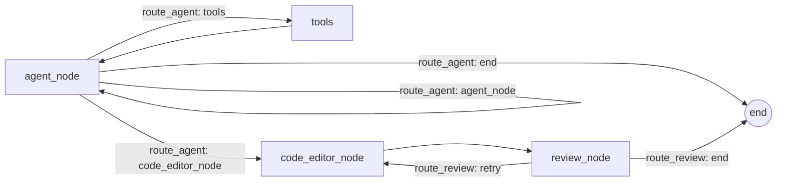

# API_6_ML

Projeto de agente para regras de comissionamento com RAG (regras em PDF e codigo-fonte), usando LangGraph para orquestracao e LanceDB como vetor store.

## Estrutura de arquivos

```
main_change.py
main_ingest_code.py
main_ingest_rules.py
notebook.ipynb
pyproject.toml
README.md
requirements.txt
scripts/
	__init__.py
	app.py
	graph_test.py
	ingest.py
src/
	agent/
		config/
			__init__.py
			settings.py
		editing/
			chains.py
			code_editor.py
			patcher.py
			prompt_builder.py
			schemas.py
			validators.py
		graph/
			__init__.py
			builder.py
			edges.py
			nodes.py
			state.py
		ingestion/
			__init__.py
			load_data.py
			pipeline.py
		models/
			outputs.py
		prompts/
			system_promt.py
		rag/
			__init__.py
			code_indexer.py
			code_retriever.py
			retriever.py
			vector_store.py
		rules/
			base_algorithm.py
		service/
			change_request_service.py
		tools/
			__init__.py
			rag_code_tool.py
			rag_rules_tool.py
data/
	preprocessed/
		rh_25.csv
		vendas_25.csv
	processed/
	raw/
		RH/
		Vendas/
vector_db/
	codebase.lance/
	pdf_rules.lance/
```

Tabela de funcoes (um item por arquivo/pasta):

| Caminho | Funcao |
| --- | --- |
| main_change.py | CLI para solicitar alteracao de regra e aplicar/dry-run. |
| main_ingest_code.py | CLI de ingestao do codigo para embeddings. |
| main_ingest_rules.py | CLI de ingestao de regras (PDF) para embeddings. |
| notebook.ipynb | Notebook de apoio/experimentos locais. |
| pyproject.toml | Metadados e dependencias do projeto. |
| README.md | Documentacao do projeto. |
| requirements.txt | Dependencias congeladas (geralmente para ambiente). |
| scripts/__init__.py | Marca o pacote de scripts. |
| scripts/app.py | UI Streamlit para conversa e exibicao de codigo gerado. |
| scripts/graph_test.py | Execucao de teste do grafo LangGraph no terminal. |
| scripts/ingest.py | CLI alternativa para ingestao de PDF via pipeline. |
| src/agent/config/__init__.py | Marca pacote de configuracao. |
| src/agent/config/settings.py | Configuracoes (modelos, chaves, paths, tabelas). |
| src/agent/editing/chains.py | Cadeias RAG simples para edicao de codigo. |
| src/agent/editing/code_editor.py | Integracao com LLMs (HF, Ollama, Groq, GenAI). |
| src/agent/editing/patcher.py | Aplica atualizacao de arquivo e gera diff. |
| src/agent/editing/prompt_builder.py | Prompt principal para gerar JSON de alteracao. |
| src/agent/editing/schemas.py | Schemas Pydantic para proposta de edicao. |
| src/agent/editing/validators.py | Validacao/sanitizacao de codigo gerado. |
| src/agent/graph/__init__.py | Marca pacote do grafo. |
| src/agent/graph/builder.py | Monta e compila o StateGraph do agente. |
| src/agent/graph/edges.py | Regras de roteamento entre nos (guardrails). |
| src/agent/graph/nodes.py | Nos do grafo (agente, tools, editor, review). |
| src/agent/graph/state.py | Estado tipado do grafo. |
| src/agent/ingestion/__init__.py | Marca pacote de ingestao. |
| src/agent/ingestion/load_data.py | Carregamento e chunking de PDF/CSV. |
| src/agent/ingestion/pipeline.py | Pipelines de ingestao (PDF e codigo). |
| src/agent/models/outputs.py | Modelos de dominio para regras e validacao. |
| src/agent/prompts/system_promt.py | System prompt do agente ReAct. |
| src/agent/rag/__init__.py | Marca pacote RAG. |
| src/agent/rag/code_indexer.py | Indexacao/chunking do codigo-fonte. |
| src/agent/rag/code_retriever.py | Recuperacao semantica de codigo no LanceDB. |
| src/agent/rag/retriever.py | Recuperacao semantica de regras no LanceDB. |
| src/agent/rag/vector_store.py | LanceDB + embeddings (Ollama) e ingestao. |
| src/agent/rules/base_algorithm.py | Algoritmo base de comissionamento. |
| src/agent/service/change_request_service.py | Orquestra RAG + edicao + patch/diff. |
| src/agent/tools/__init__.py | Marca pacote de tools. |
| src/agent/tools/rag_code_tool.py | Tool de busca de regras de negocio no RAG. |
| src/agent/tools/rag_rules_tool.py | Tool de busca de trechos de codigo no RAG. |
| data/preprocessed/ | Dados pre-processados para analises. |
| data/preprocessed/rh_25.csv | Base de RH (exemplo). |
| data/preprocessed/vendas_25.csv | Base de vendas (exemplo). |
| data/processed/ | Saidas processadas do pipeline. |
| data/raw/ | Dados brutos por dominio. |
| data/raw/RH/ | Dados brutos de RH. |
| data/raw/Vendas/ | Dados brutos de vendas. |
| vector_db/ | Persistencia do LanceDB. |
| vector_db/codebase.lance/ | Tabela de embeddings do codigo-fonte. |
| vector_db/pdf_rules.lance/ | Tabela de embeddings das regras em PDF. |

## Comandos para criar embeddings

Antes de iniciar, garanta que o Ollama esteja rodando e que o modelo de embedding configurado em `settings.embed_model` esteja disponivel.

Ingestao do codigo-fonte (embeddings do repositorio):

```bash
python main_ingest_code.py --root src --overwrite
```

Ingestao de regras em PDF:

```bash
python main_ingest_rules.py --pdf /caminho/para/regras.pdf --overwrite
```

Alternativa via pipeline:

```bash
python scripts/ingest.py --pdf /caminho/para/regras.pdf --overwrite
```

## Fluxo do LangGraph (Mermaid)



## Stack de tecnologias

- Python 3.10+
- LangChain (core, community, HuggingFace, Groq, Ollama, Google GenAI/VertexAI)
- LangGraph
- LanceDB
- Ollama (embeddings)
- Streamlit (UI)
- FastAPI + Uvicorn (API)
- PyMuPDF (leitura de PDF)
- Pandas + OpenPyXL (dados tabulares)
- MLflow (rastreamento/experimentos)